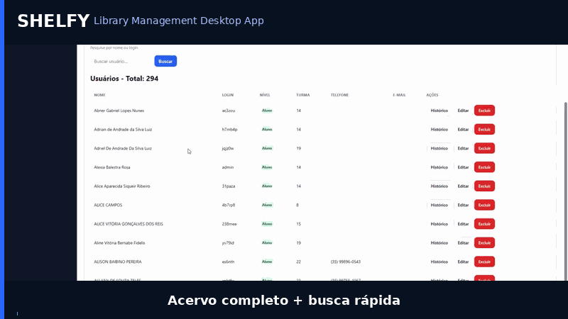

# 📚 Shelfy

[](https://github.com/Chamfrado/Shelfy)
[](https://www.microsoft.com/windows)
[](https://www.electronjs.org)
[](LICENSE)

Uma solução desktop pensada para bibliotecas escolares e instituições que precisam de um sistema de gestão de acervo leve, offline e fácil de operar.

---

## 🎯 Sobre o Shelfy

Shelfy é um sistema desktop completo para gerenciamento de bibliotecas escolares. Ele nasceu de um problema real: muitas escolas e bibliotecas não têm recursos para soluções em nuvem e tampouco dispõem de infraestrutura ou equipe técnica para manter um servidor local.

O Shelfy foi desenvolvido para ser:

- 100% offline
- sem dependência de internet
- sem servidor dedicado
- simples de instalar e usar
- compatível com qualquer computador Windows

A proposta é entregar acessibilidade, segurança de dados local e autonomia para equipes escolares.

---

## ✨ Destaques do produto

- Personalização institucional com nome, cidade, UF e logo
- Interface direta e foco nas rotinas de biblioteca
- Relatórios gerados localmente em PDF e CSV
- Backup manual e automático sem complicação
- Importação via CSV com validação e upsert

---

## 🎬 Demonstração



> Um preview visual como `./docs/preview.gif` faz toda a diferença ao apresentar o Shelfy como projeto destaque.

---

## 🧠 Arquitetura e tecnologia

Shelfy é construído sobre uma stack intencional:

- **Electron** para uma experiência desktop com instalador Windows (.exe)
- **SQLite** como banco local leve e sem servidor
- **Node.js + JavaScript** no backend desktop
- **HTML + CSS puro** na interface
- **PDFKit** para geração de relatórios e impressão local

### Por que Electron + SQLite?

A escolha reforça o conceito **offline-first**. O Shelfy opera inteiramente no computador do usuário, preserva dados na máquina e remove o risco de dependência de conexão ou serviços externos. Isso torna o produto robusto em escolas públicas, bibliotecas comunitárias e ambientes com infraestrutura limitada.

---

## 👥 Público-alvo

- Escolas públicas
- Bibliotecas escolares
- Bibliotecas comunitárias
- Instituições com poucos recursos técnicos
- Projetos sociais que precisam de gestão de acervo com baixo custo

---

## 🚀 Funcionalidades principais

### Acervo

- cadastro de livros com capa
- categorias e tipos configuráveis
- controle de quantidade em estoque
- histórico completo por livro

### Usuários

- cadastro completo de usuários
- níveis de acesso: **Admin**, **Aluno**, **Operador**
- histórico de empréstimos por usuário

### Empréstimos

- registro rápido de retirada
- controle automático de estoque
- devolução com um clique
- bloqueio automático de usuários com atraso

### Inadimplentes

- lista automática de atrasos
- cálculo de dias em atraso
- exportação em PDF

### Relatórios

- exportação em CSV
- relatório de empréstimos em PDF
- relatório de inadimplentes em PDF

### Importação

- importação de dados via CSV
- validação completa de campos
- atualização automática (upsert)
- relatório de erros para correção rápida

### Backup

- backup manual seguro
- backup automático ao fechar o sistema
- restauração simples do banco local
- abertura do diretório de backup direto pela interface

---

## 🧩 Estrutura do projeto

```text
LibraryControl/
  README.md
  shelfy/
    package.json
    forge.config.js
    schema-atual.sql
    src/
      main/
        main.js
        preload.js
        db/
          connection.js
          acervo.repo.js
          usuarios.repo.js
          emprestimos.repo.js
          configuracao.repo.js
          migrations/
      renderer/
        index.html
        app.js
        styles.css
        acervo.js
        usuarios.js
        emprestimos.js
        inadimplentes.js
        configuacoes.js
        creditos.js
```

> Recomenda-se criar uma pasta adicional `docs/` para imagens, GIFs de preview e documentação suplementar.

---

## ⚙️ Regras de negócio

- Usuários com empréstimos em atraso são bloqueados automaticamente até a devolução
- Estoque é ajustado imediatamente a cada empréstimo e devolução
- A personalização institucional é aplicada em relatórios e na interface
- Backup local garante recuperação rápida do banco SQLite

---

## 🛠️ Instalação (desenvolvimento)

```bash
git clone https://github.com/Chamfrado/Shelfy.git
cd Shelfy/shelfy
npm install
npm start
```

---

## 🏗️ Build

```bash
npm run build
```

- Saída do instalador e artefatos: `shelfy/dist`

---

## 📦 Download

Baixe a versão estável a partir de [GitHub Releases](https://github.com/Chamfrado/Shelfy/releases).

---

## 🤝 Contribuição

Contribua para tornar o Shelfy ainda mais acessível para escolas e bibliotecas.

- Abra uma issue para sugerir melhorias
- Envie um pull request com correções ou novas funcionalidades
- Mantenha a comunicação clara e objetiva

### Boas práticas

- Faça fork do repositório
- Crie branchs com nomes descritivos
- Escreva commits claros no padrão Conventional Commits
- Documente alterações importantes no README ou no código

---

## 🛣️ Roadmap

- leitor de código de barras integrado
- sistema de multas e notificações de atraso
- versão SaaS para instituições com rede local
- dashboards analíticos para indicadores de acervo e empréstimos
- suporte a múltiplas bibliotecas em uma única instalação

---

## 👤 Autor

- **Lohran Cintra da Silva**
- Empresa: **Chamfrado's Solutions**
- LinkedIn: https://www.linkedin.com/in/lohrancintra
- GitHub: https://github.com/Chamfrado

---

## ⭐ Call to action

Se você acredita em tecnologia que amplie acesso e eficiência para escolas e bibliotecas, dê uma estrela no repositório e compartilhe o Shelfy com sua rede.
